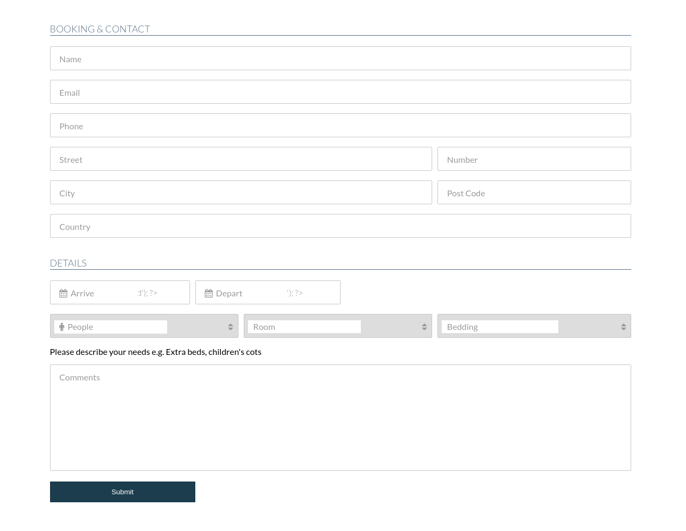

## Time for some HTML foundation notes

### Introduction
HTML is the point where you will probably start your career as a front end career. So it's very important to understand HTML and its foundation concepts. HTML is the document which is responsible for displaying content on the page and tells the browser how to display content on the page. Apart from creating webpages, you can also create games with the help of CSS and Javascript which are way more interesting and challenging to learn. Along with HTML, you should also learn CSS and Javascript to create the best possible webpages

### Learning Objectives
Main objectives of learning this module would be:
- To be able to create a basic template for HTML
- To be able to apply attributes to elements
- To be able to add "META" tags to the page
- To be able to include various external files and internal project files
- To be able to understand differences between the relative path and absolute path when including files
- To be able to use "TEXT" related tags and their respective attributes
- To be able to add "LISTS" on the page and various types of "LISTS"
- To be able to navigate between pages or linking to external pages using "LINK" tags
- To be able to conveniently place and align "IMAGES" in various sections on the web page
- To be able to display data and play around with "TABLES"
- To be able to create a "FORM" that is good enough to post data to the server
- To be able to use newly added elements in HTML5
- To be able to add "flash/video/audio" tags and play around with their respective controls

### What you will be able to build?
Once you have the confidence and clear understanding of how HTML works and how to structure the document with elements, you are ready to build something useful and applicable for the real world. How about a form which accepts user inputs for online hotel room booking. It looks exactly as below:

Ohh, wait... This looks ugly, or at least not appealing to the eyes, right? 
How can we make it look better? To do so, you will need a superpower tool named "CSS". Just take a look at how it looks post applying some CSS to the HTML elements which we have created.

Doesn't it look super attractive now? That's the power of CSS as it can transform weirdly looking HTML layout to something super awesome. 

### What you must do
- To build the above layout, you would first need a full-fledged HTML and complete reference tutorial which is available [here](https://www.youtube.com/watch?v=mU6anWqZJcc) and is completely free for use (11 hrs of the best time you could possibly spend learning something in and out)
- Once you have completed the above tutorial, am sure you are in a position to build any web layout which comes your way. So your next step is to mimic and get used with best practices for building webpages and you can find it [here](https://www.youtube.com/watch?v=ZeDP-rzOnAA) and that too for free
- By this time, you are even hands-on with what you are doing and understand the superpowers of HTML and CSS. Now its time to build some pages which work seamlessly on both desktop browser and mobile browser as well. You can find some very good references [here](https://www.youtube.com/results?search_query=build+complete+responsive+website+design+using+html5+css3+javascript+)
- If you are not sure if you can spend your time watching tutorial videos, then there is plenty of good resources only which will make you a master of HTML and CSS. You can refer one of these [here](https://www.oreilly.com/library/view/head-first-html5/9781449314712/)
- Time to learn some CSS based frameworks like [Bootstrap](https://getbootstrap.com/) and [Foundation](https://foundation.zurb.com/)
- Standard HTML documentation can be found here [mdn](https://developer.mozilla.org/en-US/docs/Web/HTML) and [w3schools] (https://www.w3schools.com/html/default.asp)
- You can use online editing tools like [codepen](https://codepen.io/) or [jsfiddle](https://jsfiddle.net/) to create pages on the go
- In case if you still need any help, there is always the best content getting uploaded online. You can instead ask google to get the best resources

### Additional Learning
- There are a lot of otherthings you can learn to compliment HTML and make it even more functional
- You can learn Javascript, which makes it possible to add dynamic functionalities to webpages
- You can learn wireframe creation tools like (https://wireframe.cc/) and (https://www.mockflow.com/)
- You can also try your hands on UX design and UI design to leave a maximum impact on users

### Knowledge Check - Quiz
1. Choose the correct HTML element for the largest heading:
	- `<head>`
	- `<h6>`
	- `<h1>`
	- `<heading>`
2. What is the correct HTML element for inserting a line break?
	- `<break-line>`
	- ` `
	- `<break>`
	- `<next-line>`
3. What is the correct HTML for adding a background color?
	- `<body style="background-color:yellow;">`
	- `<body bg="yellow">`
	- `<background>yellow</background>`
4. Choose the correct HTML element to define important text
	- `<important>`
	- `<strong>`
	- `<b>`
	- `<i>`

### Project Tasks
User story 1: Create a login form
User story 2: Replicate Google home page
User story 3: Create a personal portfolio web landing page

### AlL THE VERY BEST
